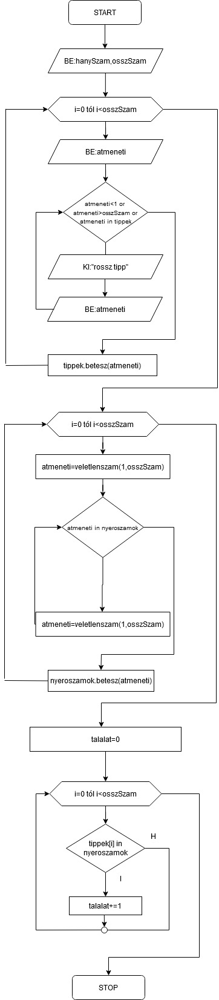

# Python ismeretek

Fejlesztő környezet: Anaconda->Spyder

Egyszerű szöveg kííratása:
```python
print("Hello World!")
print('Hello World')
```
Számok esetében az eredmény jelenik meg:
```python
print(2+8+21)
print((2*10)+251)
```

A nullával való osztás hibát okoz(division by zero):
```python
print(10/0)
```
Karakterek esetében a + összefűzést jelent.
```python
print('2'+'2')
```
Háromszor kiírja a szöveget
```python
print("valami "*3)
```
Hatványozás
```python
print(2**2)
```
### Változók

A változók a memória valamely részét jelentik, ahol értéket tárolhatunk. A változót egy névvel azonosítjuk.

```python
a=10
b=2
```
Pythonban a változók típusának beállítása automatikus, a változóba beírt érték típusa alapján végzi a nyelv.

### Értékadó utasítások

```python
a=10
b=2

a=a+b
a=a*b

print(a)
```
**Értékadások rövidített formában**
```python
a+=b
a*=b
a-=b
a/=b
```
### Bevitel a felhasználótól, az input() függvény

Alaphelyzetben az input() szöveges adatot tesz a változóba.
```c#
a=input()
b=input()

print(a+b)
```
### Bevitel egész típusú változóba
Itt az int() függvény alakítja át a szöveges adatot szám típusúra.
```python
a=int(input())
b=int(input())

print(a+b)
```
### Bevitel, ha lebegőpontos számokat akarunk használni
Itt a float() függvény alakítja lebegőpontosra a bevitt értéket.
```py
a=float(input())
b=float(input())

print(a+b)
```
### Összehasonlítások
```py
print(c==10)
print(c!=10)
print(c>10)
print(c<10)
print(c>=10)
print(c<=10)
```
### Elágazások, esetszétválasztás

**Egyszeres egyágú elágazás**
```py
a=0

if (a>0):
    print("A szám pozitív!")
```
**Egyszeres két ágú elágazás**
```py
a=0
if (a>0):
    print("A szám pozitív")
else:
    print("A szám negatív!")   
```
**Többszörös elágazás**

```py
a=0
if (a>0):
    print("A szám pozitív")
elif(a==0):    
    print("A szám nulla")
else:
    print("A szám negatív!")   
```
### Műveletek szöveges változókkal

```py
a="valami"
b="ValAmi"
```
**Megjelenítés kisbetűsen**
```py
print(b.lower())
```
**Megjelenítés nagybetűsen**
```py
print(a.upper())
```

**Szövegek összehasonlítása**
```py
a="valami"
b="ValAmi"

if(a==b):
    print("Megegyeznek")
else:
    print("Nem egyeznek meg")   
```
A fenti kódot futtatva azt kapjuk, hogy a szövegek nem egyeznek meg. Tartalmilag igen, de az eltérő írásmód miatt különbözőnek tekinti őket a program.

Amennyiben arra vagyunk kíváncsiak, hogy a tartalmuk is egyezik-e, úgy azonos írásmóddal (kisbetűs, nagybetűs) kell őket összehasonlítani.
```py
a="valami"
b="ValAmi"

if(a.upper()==b.upper()):
    print("Megegyeznek")
else:
    print("Nem egyeznek meg")   
```

Így azt kapjuk, hogy megegyeznek.

### Egy string kezdete, vége megegyezik egy másik szöveggel?

```py
a="valami"
b="ValAmi"
print(a.startswith("va"))    
print(a.endswith("ami"))   
```

**Szövegrész keresése egy másik szövegben**
```py
a="valami"
print(a.find("laza"))
```
A find funkció -1 et ad vissza, ha az megadott szöveg nem szerepel a szöveges változóban. Ha a megadott szöveget tartalmazza a változó, akkor a szövegrész kezdő indexét adja vissza.

**Hányszor tartalmazza az adott szöveg a megadottat**
A count() fogja ezt megmondani.
```py
print(a.count("la"))
```
**Szövegrészek cseréje**
```py
a="valami"
print(a.replace("a","b"))
```

**Logikai vizsgálatok**
```py
c="a"
print(c.isdigit())
print(c.isalnum())
```
Az első esetben vizsgáljuk, hogy c szám-e, a másodikban, hogy c alfanumerikus karakter-e.

**Szövegek darabolása**
Gyakori feladat, hogy felosszunk egy szöveget, több részre. A **split** funkció fogja ezt elvégezni, amelynek azt a karaktert kell megadni,
amelyik mentén a szöveget fel akarjuk darabolni. A darabolás eredményeképpen egy tömb jön létre.
```py
adat="Kiss Elek,1989,Szeged,442669"
adatok=adat.split(",")
print(adatok)
```

**Szövegrész kiemelése az adott szöveges változóból**

Nézzük az alábbi szöveges változót, ami egy dátumot tárol:
```py
datum="2019.12.23"
```
Hogyan lehet kiemelni csak az évet?
```py
ev=datum[0:4]
```
A szögletes zárójelek között azt adjuk meg, hogy mely karaktertől kezdve, mely karakterig emeljük(másoljuk) ki a szövegből.
```py
honap=datum[5:7]
nap=datum[8:]
```
**További megoldások:**
A szöveg utolsó 3 karaktere:
```py
print(datum[-3:])
```
A szöveg összes karaktere az utolsó 3 kivételével
```py
print(datum[:-3])
```
### Tömbök

Azonos típusú elemeket tartalmazó adatszerkezet.
Az elemek számozása 0-tól kezdődik.
```py
szamok=[1,236,554,677,12,998,332,67,191,111,704,268]
```
**Adott indexű elem kiíratása**
```py
print(szamok[0])
print(szamok[3])
```

**Tömb elemszámának kiíratása**
```py
print(len(szamok))
```

**Tömb/lista elemeinek bővítése**
```py
nevek=[]
nevek.append('Ubul')
nevek.append('Zénó')
```
Az **append** paranccsal a lista végére tudunk új elemet beszúrni.

**Beszúrás a lista egy adott helyére**
```py
nevek.insert(0,'Jolán')
nevek.insert(2,'Janka')
```
Az **insert** parancsnak meg tudjuk adni azt az indexet, ahová be kell szúrni az új elemet, így már létező elemek közé is be tudunk szúrni újat.

**Lista kiürítése**
```py
nevek.clear()
```
A **clear()** parancs használata után a lista üres.

### FOR ciklus

Ez a ciklus jó választás egy adatszerkezet elemeinek bejárására.
Tömb elemeinek a kiíratása FOR-al:
```py
for i in szamok:
    print(i)
```
Fontos, hogy a FOR-hoz tartozó utasításoknak ugyanakkora behúzással kell szerepelniük.

### A Range() függvény
A RANGE() függvény egy számsort készít, amely felhasználható egy adatszerkezet bejárásakor.

```py
r=range(0,20)
print(*r)
```

A RANGE() gyakran szerepel a FOR ciklusban is.

```py
for i in range(0,len(szamok)):
    szamok[i]+=10;
    print(str(i)+":"+str(szamok[i]))
```

### Elöltesztelő ciklus, WHILE

A WHILE ciklusnál egy belépési feltételt kell megfogalmazni, a ciklus mindaddig fut, amíg a belépési feltétel teljesül.
Fontos gondoskodni arról, hogy a ciklus futása véget tudjon érni.

**Egy elrontott WHILE**
```py
a=0
while (a<20):
    print(a)
```
Észre kell venni, hogy a értéke nem módosul, ezért ez a ciklus egy ún. végtelen ciklus.

**Az előbbi példa helyesen**
```py
while (a<20):
    print(a)
    a+=1
```
Látszik, hogy **a** értéke minden egyes végrehajtáskor nő, így a ciklus **a=20** értéknél befejezi a futását.

### Keresés listában
A  klasszikus módszer az az hogy egy ciklussal végigmegyek a listán, minden elemet összehasonlítok a keresett elemmel. Ha van a keresett elemmel megegyező elem, akkor
egy logikai változó értékének az True-ra állításával jelzem ez, illetve a **break** parancs használatával megszakítom a ciklust, hogy ne fusson tovább feleslegesen.

```py
nevek=['Ubul','Elek','Jakab','Tamás','Eleonóra']
keres='Ubul'
megvan=True
for i in nevek:
    if(i==keres):
        megvan=False
        break
print(megvan)        
```
Nyilván ezt fáradtságos lenne mindig megírni, ezért a Python-ban (és más nyelvekben is természetesen) van beépített funkció arra, meg meg tudjuk nézni, hogy egy elem szerepel-e egy listában. Python-ban az ***in*** operátor vizsgálja meg, hogy egy érték megtalálható-e egy listában. Eredményül mindig egy logikai értéket(True/False) kapunk.
```py
nevek=['Ubul','Elek','Jakab','Tamás','Eleonóra']
keres='Ubul'
print(keres in nevek)
```

### Véletlen számok generálása

Véletlen számok generálásához Python-ban be kell tölteni a random modult. A betöltött modulnak az **as** kulccszóval adunk egy olyan nevet, amelyen a programból hivakozunk rá.
```py
import random as rnd
```
Egy véletlen érték generálása a **randint** paranccsal végezhető el, meg kell adnunk, hogy milyen határok között akarunk értékeket generálni. A parancs a modul nevén belül szerepel, ponttal elválasztva.
```py
veletlenszam=rnd.randint(0,100)
```
### Maradékos osztás

A maradékos osztást a **%** jellel jelöljük. Ennél a műveletnél az eredmény az osztáskor jelentkező maradék. 

Például:

**6%2=0**, mert 2 pontosan háromszor van meg 6-ban.

**6%4=2**, mert 4 egyszer van meg 6 ban, és a maradék 2.

**Egy egyszerű példa Python-ban:**
```py
if(6%2==0):
    print("Osztható maradék nélkül")
else:
    print("Nem osztható maradék nélkül")    
```    

## Színek használata Python-ban

Ha a megjelenített szöveget szeretnénk színezni, akkor szükség lesz valamilyen modul betöltésére. Egy ilyen  sok közül a ***colorama***
Először be kell importálni a modul szükséges elemeit.
```py
from colorama import Fore,Back,Style
```
Kiíratás egy adott szövegszínnel(Fore ->Foreground, azaz előtér):
```py
print(Fore.GREEN+"Zöld betűk"+Style.RESET_ALL)
```

Kiíratás egy adott szövegszínnel, és háttérszínnel:(Back ->Background, azaz háttér):
```py
print(Fore.BLUE,Back.MAGENTA,Style.NORMAL+"Magenta háttér"+Style.RESET_ALL)
```
A **Style.RESET_ALL** állít vissza mindent az alaphelyzetbe.


## Lottó játék algoritmusa
A játék induláskor kérje be a felhasználótól azt, hogy hány számmal akar játszani, illetve hány számból akarja sorsoltatni a nyerőszámokat. A klasszikus ötös lottó esetében 90 szám közül lehet 5-öt választani.
Az induló adatok után a program kérje be a felhasználótól a megadott számú tippeket. Nem lehet két egyforma tipp, valamint a tippeknek a megadott számtartományba kell esniük.
Sorsoláskor figyelni kell arra, hogy nem lehet egyforma nyerőszám.
A játék végén meg kell határozni, hogy a játékos hány számot talált el.

### Mondatszerű leírás
```py
Be hanySzam
Be osszSzam
Növekményes ciklus i=0-tól hanySzam-ig
	Be atmeneti
	Ciklus amíg (atmeneti<1 vagy atmeneti>osszSzam vagy atmeneti in tippek)
		Ki "Rossz tipp, újra!"
		Be atmeneti
	tippek.betesz(atmeneti)	
Növekményes ciklus i=0-tól hanySzam-ig
	atmeneti=veletlenszam(1,osszSzam)
	Ciklus amíg(atmeneti in nyeroszamok)
		atmeneti=veletlenszam(1,osszSzam)
	nyeroszamok.betesz(atmeneti)
talalat=0	
Növekményes ciklus i=0-tól hanySzam-ig
	ha(tippek[i] in nyeroszamok) akkor
		talalat+=1
Ki:talalat		
```
### Folyamatábrával



```py
from colorama import Fore,Back,Style
import random as rnd

tippek=[]
nyeroszamok=[]

print("Hány számmal játszunk?:")
hanySzam=int(input())
print("Hány számból sorsolunk?:")
osszSzam=int(input())
#Tippelés
for i in range(0,hanySzam):
    print("Tipp "+str(i+1)+":")
    atmeneti=int(input())
    while (atmeneti<1 or atmeneti>osszSzam or atmeneti in tippek):
            print("Rossz tipp, újra! " + str(i+1) + ":")
            atmeneti = int(input())
    tippek.append(atmeneti)

print(tippek)

#Sorsolás
for i in range(0,hanySzam):
    atmeneti=rnd.randint(1,osszSzam)
    while (atmeneti in nyeroszamok):
        atmeneti = rnd.randint(1, osszSzam)
    nyeroszamok.append(atmeneti)

print(nyeroszamok)

talalat=0
for i in range(0,hanySzam):
    if (tippek[i] in nyeroszamok):
        talalat+=1

print("Talalat:"+str(talalat))
#Feladat : Írassa ki ciklussal a tippeket,
# jelölje színnel az eltalált számokat(ha vannak)
```
## Programozási tételek megvalósítása Python-ban

### Keresés, kiválogatás (negatív számok kiválogatása egy másik listába)
```py
szamok=[10,-2,122,-31,-19,26,33,-121,59]        
negativak=[]

for i in range(0,len(szamok)):
    if(szamok[i]<0):
        negativak.append(szamok[i])
print(negativak)	
```

### Megszámlálás
```py
szamok=[10,-2,122,-31,-19,26,33,-121,59]        
darab=0

for i in range(0,len(szamok)):
    if(szamok[i]>-1):
        #darab=darab+1
        darab+=1

print(darab)
```

### Összegzés
```py
szamok=[10,-2,122,-31,-19,26,33,-121,59]        
osszeg=0

for i in range(0,len(szamok)):
    osszeg+=szamok[i]
    
print(osszeg)   
```

### Összegzés feltétellel
```py
szamok=[10,-2,122,-31,-19,26,33,-121,59]        
osszeg=0

for i in range(0,len(szamok)):
    if(szamok[i]>-1):
        osszeg+=szamok[i]

print(osszeg)   
```

### Minimum, maximum kiválasztás
```py
szamok=[10,-2,122,-31,-19,26,33,-121,59]        
min=szamok[0]
max=szamok[0]

for i in range(0,len(szamok)):
    if(szamok[i]<min):
        min=szamok[i]
    if(szamok[i]>max):
        max=szamok[i]

print("Min:"+str(min))        
print("Max:"+str(max))
```
### Rendezés
```py
szamok=[10,-2,122,-31,-19,26,33,-121,59]        
for i in range(0,len(szamok)-1):
    for j in range(i+1,len(szamok)):
        if(szamok[i]>szamok[j]):
            temp=szamok[i]
            szamok[i]=szamok[j]
            szamok[j]=temp

print(szamok)
```
## A numpy (numeric python) modul
Ez a modul általában telepítést igényel és utána használható (kivételt általában az online környezetek jelentenek). A modul rengeteg tömbökkel kapcsolatos műveletet, számítást támogat.

A modul importálása (az AS utáni álnév bármi lehet de legtöbbször a modul nevének rövidítése)

```py
import numpy as np
```
létrehozunk egy listát:
```py
szamok=[11,22,34,56,76,32,1,233,119,113,876,345]
```
átalakítás numpy tömbbé:
```py
npszamok=np.array(szamok)
print(npszamok)
```
Az elemekhez való hozzáférés ugyanaz, mint a listák esetében, itt is 0-tól kezdődik az indexelés:
```py
print(npszamok[1])
```

